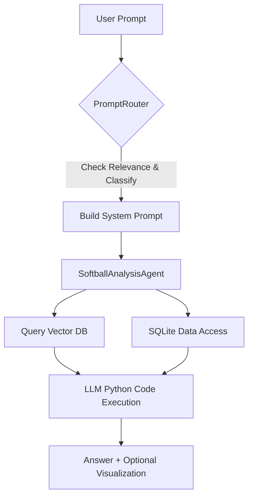

---

# 🥎 Softball Analysis Assistant

The **Softball Analysis Assistant** is an AI-powered system that enables users to analyze and visualize softball data through natural language prompts.

---

## 🚀 Overview

The system intelligently routes user prompts to the right analysis or visualization agents. It connects to both:
- A **SQLite database** containing structured softball data.
- A **Chroma vector database** containing a data dictionary to guide column selection.

It uses an LLM (GPT-4o-mini) to generate Python code, create plots, and answer complex softball analytics questions.

---

## 🧩 Key Components

- **PromptRouter**:  
  - Checks if a prompt is softball-related.
  - Classifies it as "analysis" or "visualization".
  - Builds a dynamic system prompt.
  - Routes the request to the agent.

- **SoftballAnalysisAgent**:  
  - Loads softball event data from SQLite.
  - Queries the vector DB to find relevant columns.
  - Executes safe Python code to generate outputs.

- **VectorDBQuerier**:  
  - Connects to ChromaDB.
  - Retrieves the most relevant column descriptions using vector search.

---

## ⚙️ Architecture Diagram



---

## 📂 Project Structure

```
/project_root/
├── structured/            # SQLite database
├── unstructured/           # Chroma vector database
├── visualizations/         # Saved plots
├── router.py               # PromptRouter
├── softball_analysis_agent.py # SoftballAnalysisAgent
├── query_vdb.py            # VectorDBQuerier
├── tools.py, llms.py       # Custom LLM tools
└── .env                    # Environment variables
```

---

## 📈 Example Usage

```python
from router import PromptRouter

router = PromptRouter()
chat_history = []

answer, updated_chat_history, visualization_path = router.route(
    "Show me a trend of pitch velocities over the season.",
    chat_history
)

print(answer)
if visualization_path:
    display_image(visualization_path)
```

---

## 🛠 Technologies

- Python 3.10+
- LangChain
- OpenAI GPT-4o-mini
- ChromaDB
- SQLite
- Pandas, Matplotlib, Seaborn

---

## 📌 Future Roadmap

- Add memory for user sessions.
- Support new prompt types (e.g., player scouting reports).
- Fine-tune an open-source softball-specific model.

---

## 📬 Contact

Created by **Ben Klassen**.

---